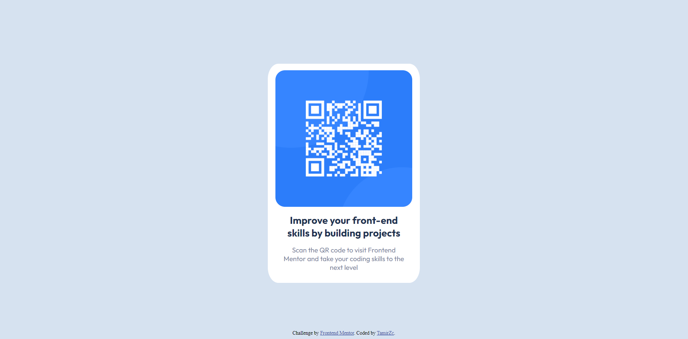

# Frontend Mentor - QR code component solution

This is a solution to the [QR code component challenge on Frontend Mentor](https://www.frontendmentor.io/challenges/qr-code-component-iux_sIO_H). Frontend Mentor challenges help you improve your coding skills by building realistic projects.

## Table of contents

- [Overview](#overview)
  - [Screenshot](#screenshot)
- [My process](#my-process)
  - [Built with](#built-with)
  - [What I learned](#what-i-learned)
- [Author](#author)

## Overview

### Screenshot



## My process

- Built index.html file
- Divided it into <div> elements with classes
- Added photo
- Created and updated CSS file

### Built with

- Semantic HTML5 markup
- CSS custom properties
- Flexbox
- Mobile-first workflow

### What I learned

I learned to add basic div elements and design them.

To run the index.html file:

```js
npx http-server
```

## Author

- Website - [TamirZc](https://github.com/tamirzc)
- Frontend Mentor - [@yourusername](https://www.frontendmentor.io/profile/yourusername)
